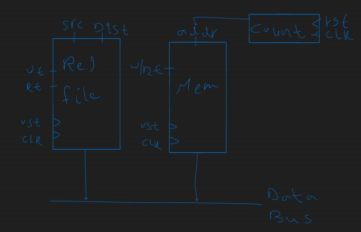
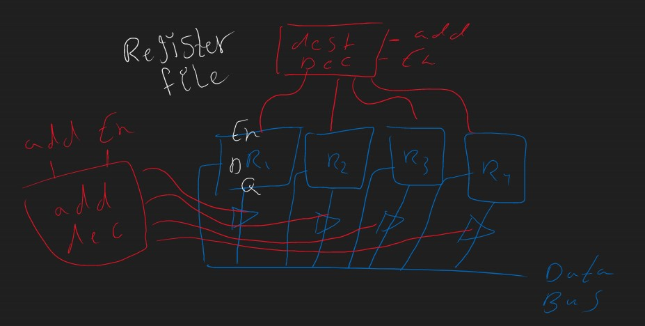
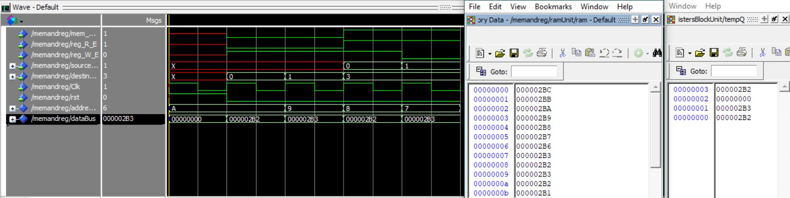

# Project Structure

**To test the project:** ``` do  testMemAndReg.do```

**Main file:**
[memAndReg](Diagrams/memAndReg.md) ([Do file](testMemAndReg.do)) The main file that integrates the memory and the register file.

**Related to the register file:**
    1. [addressDecoder](Diagrams/addressDecoder.md) ([Do file](testAddDecoder.do)) Decodes the source and destination addresses.
    2. [registerBlock](Diagrams/registerBlock.md) The actual registers of the register file. 
    3. [registerFile](Diagrams/registerFile.md) ([Do file](testRegFile.do)) The register file.
   
**Related to the Memory:**
    1. [Ram](Diagrams/Ram.md) The actual memory.
    2. [counter](Diagrams/counter.md) The counter that is used to access the memory. 
    3. [memCount](Diagrams/memCount.md) ([Do file](testMemCount.do)) Integration between the memory and the counter for the sake of testing.

**N.B.: click on the file name to open a detailed schematic diagram(.md file).**

**Schematic**



**Output**
**WaveForm, Memory, Registers**
>   r0 => 2B2
    r1 => 2B3
    r2 => 0x0
    r3 => 2B2
    mem[7] => 2B3




